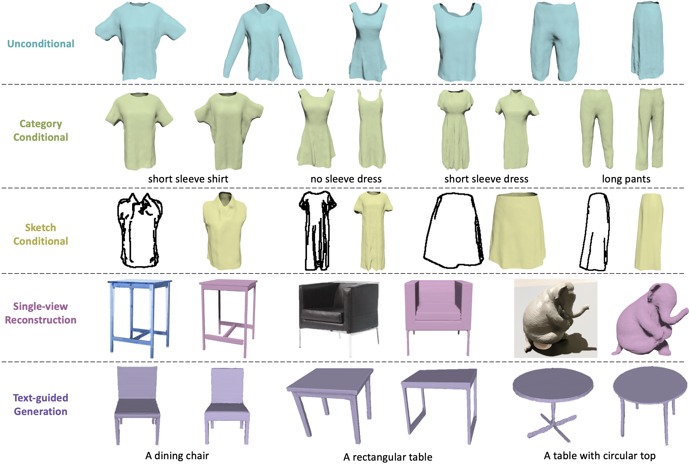

# Surf-D: Generating High-Quality Surfaces of Arbitrary Topologies Using Diffusion Models

**[Project Page](https://yzmblog.github.io/projects/SurfD/)**
| **[Paper](https://arxiv.org/abs/2311.17050)**

>We present **Surf-D**, a novel method for generating high-quality 3D shapes as **Surfaces** with arbitrary topologies using **Diffusion** models. Previous methods explored shape generation with different representations and they suffer from limited topologies and poor geometry details. To generate high-quality surfaces of arbitrary topologies, we use the Unsigned Distance Field (UDF) as our surface representation to accommodate arbitrary topologies. Furthermore, we propose a new pipeline that employs a point-based AutoEncoder to learn a compact and continuous latent space for accurately encoding UDF and support high-resolution mesh extraction. We further show that our new pipeline significantly outperforms the prior approaches to learning the distance fields, such as the grid-based AutoEncoder, which is not scalable and incapable of learning accurate UDF. In addition, we adopt a curriculum learning strategy to efficiently embed various surfaces. With the pretrained shape latent space, we employ a latent diffusion model to acquire the distribution of various shapes. Extensive experiments are presented on using Surf-D for unconditional generation, category conditional generation, image conditional generation, and text-to-shape tasks. The experiments demonstrate the superior performance of Surf-D in shape generation across multiple modalities as conditions.

## Unconditional Generation

By unconditional sampling latent codes in latent space, Surf-D can produce high-quality and diverse shapes. We also calculate their average CD to each object in the training set to confirm that our model is capable of producing unique shapes.

## Category Conditional Generation

Given the category condition, Surf-D generates different categories of detailed 3D shapes with high-quality and diversity.

## Generation for Virtual Try-on

We explore more applications that Surf-D can be applied to. As shown in the video, the clothes generated by Surf-D can be used for virtual try-on with high quality and fidelity. Imagine that you can just use sketches to generate whatever clothes you want, then put on your own avatar to try-on. Although it may sound crazy, this can be achieved with our proposed Surf-D!

## Single-view 3D Reconstruction

Given single-view images of objects, Surf-D can produce high-quality results faithfully aligned with input images.

## Text2Shape

Give the text description of objects, Surf-D produces high-quality results aligned with input texts.

