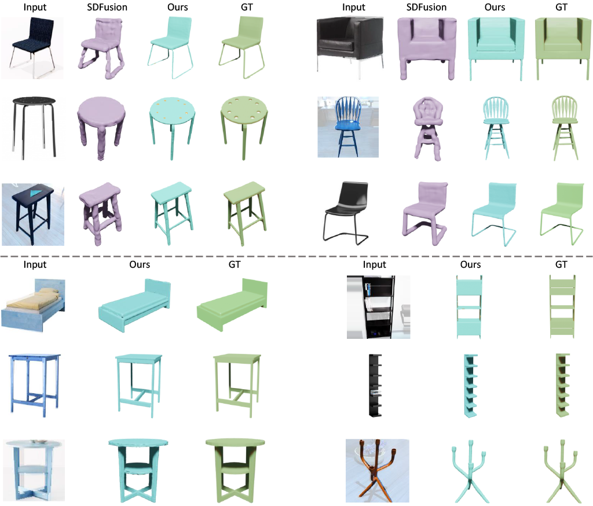
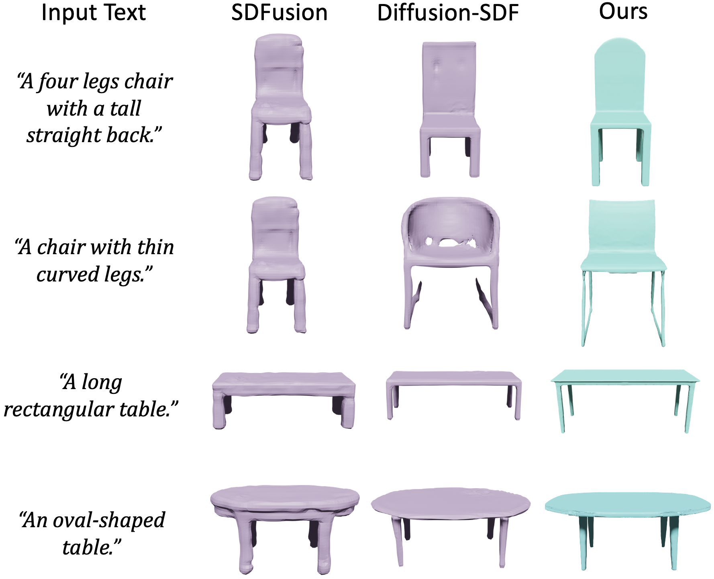

# Surf-D: High-Quality Surface Generation for Arbitrary Topologies using Diffusion Models

**[Project Page](https://yzmblog.github.io/projects/MonoHuman)**
| **[Paper](https://arxiv.org/abs/2311.17050)**

>we present **Surf-D**, a novel method for generating high-quality 3D shapes as **Surfaces** with arbitrary topologies using **Diffusion** models. Specifically, we adopt Unsigned Distance Field (UDF) as the surface representation, as it excels in handling arbitrary topologies, enabling the generation of complex shapes. While the prior methods explored shape generation with different representations, they suffer from limited topologies and geometry details. Moreover, it's non-trivial to directly extend prior diffusion models to UDF because they lack spatial continuity due to the discrete volume structure. However, UDF requires accurate gradients for mesh extraction and learning. To tackle the issues, we first leverage a point-based auto-encoder to learn a compact latent space, which supports gradient querying for any input point through differentiation to effectively capture intricate geometry at a high resolution. Since the learning difficulty for various shapes can differ, a curriculum learning strategy is employed to efficiently embed various surfaces, enhancing the whole embedding process. With pretrained shape latent space, we employ a latent diffusion model to acquire the distribution of various shapes. Our approach demonstrates superior performance in shape generation across multiple modalities and conducts extensive experiments in unconditional generation, category conditional generation, 3D reconstruction from images, and text-to-shape tasks.

## Unconditional Generation

## Category Conditional Generation

## Generation for Virtual Try-on

## Single-view 3D Reconstruction

## Text2Shape

